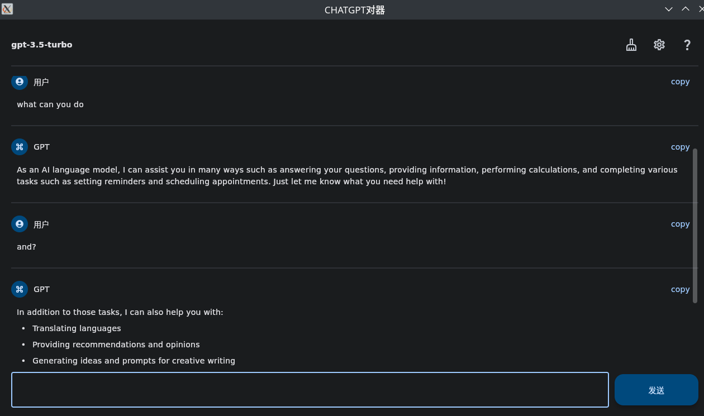

**Fork from [cuifengcn/flet-ui-openai](https://github.com/cuifengcn/flet-ui-openai)**

# flet-ui-openai
对OpenAI API的包装，适用于ChatGPT聊天。

# 更改内容
- 更换`poetry`进行环境管理，并清理无用软件包
- 清理获取代理部分的代码，在Linux上无法使用，清理后便可
- 更改获取API的逻辑，可以直接从环境变量中读取

# 软件不足及未来改进之方向
- 目前不能存储聊天记录
- 目前不能切换主题

